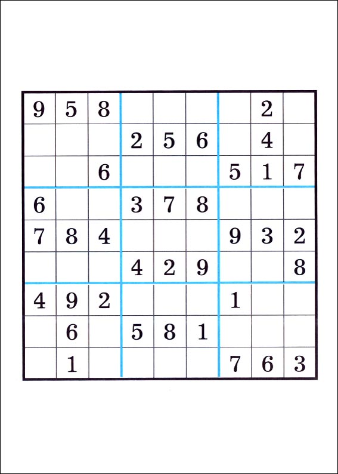
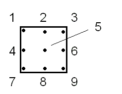
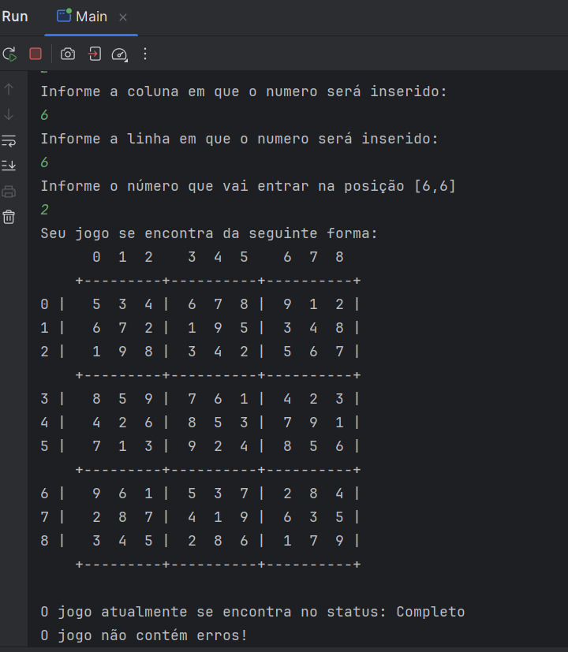

# Jogo Sudoku

## Requisitos

Deve-se ter um menu interativo onde poderemos escolher entre as seguintes opções:

1. `Iniciar um novo jogo`  
   Deve-se exibir na tela o jogo inicial, com os espaços preenchidos somente pelos números iniciais (usar os `args` do método `main` para informar os números iniciais e suas devidas posições).

2. `Colocar um novo número`  
   Deve-se solicitar as seguintes informações do jogador: número a ser colocado, índice horizontal e índice vertical do número.  
   Não se deve permitir que seja colocado um número em uma posição que já esteja preenchida (seja número fixo ou informado pelo jogador).

3. `Remover um número`  
   Deve-se solicitar os índices verticais e horizontais do número que deseja remover.  
   Caso o número seja um número fixo do jogo, deve-se exibir uma mensagem informando que o número não pode ser removido.

4. `Verificar jogo`  
   Visualizar a situação atual do jogo.

5. `Verificar status do jogo`  
   Deve-se verificar o status atual do jogo (`não iniciado`, `incompleto` e `completo`) e se contém ou não erros.  
   O jogo está errado quando tem números em posições conflitantes.  
   Todos os status do jogo podem conter ou não erros, exceto o status `não iniciado`, que é sempre sem erro.

6. `Limpar`  
   Remove todos os números informados pelo usuário e mantém os números fixos do jogo.

7. `Finalizar o jogo`  
   Se o jogo estiver com todos os espaços preenchidos de forma válida, o jogo é encerrado.  
   Caso contrário, deve informar ao usuário que ele deve preencher todos os espaços com seus respectivos números.

## Extras (requisitos opcionais)

1. Usar algum ambiente gráfico (AWT, Swing) para criação do jogo.
2. Ter a opção de colocar números de rascunho nos quadrados; para isso, deve-se seguir o modelo proposto na sessão `modelo de rascunho`.

### modelo com números

### modelo de rascunho

### Adicionando as variáveis para o main:
IDE IntelliJ  
Nos 3 pontinhos ao lado do run. Selecione Configuration>Edit.
Adicione em 'Program Arguments'

### Imagens do jogo
